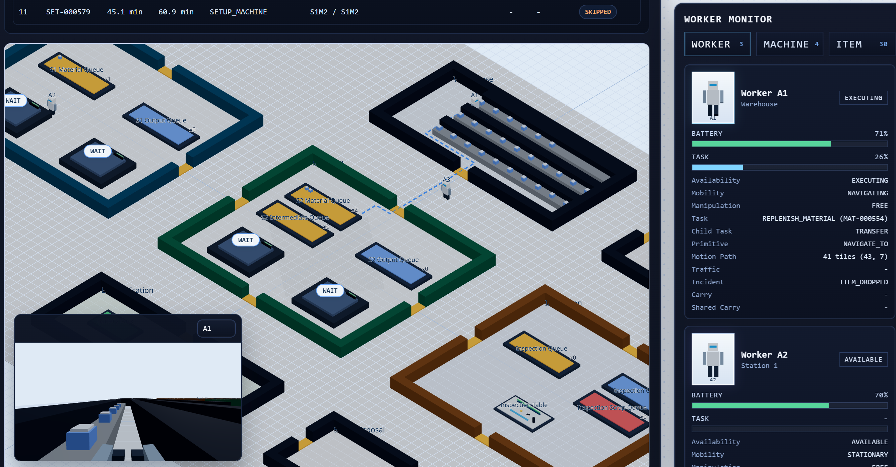

# ManSim v0.4.3

ManSim은 제조 공장의 물류, 설비, 품질 검사, 휴머노이드 작업자 운영을 다루는 discrete-event simulation 워크스페이스입니다. 기본 시뮬레이션, KPI dashboard, Gantt chart, 2D Replay Studio, 독립형 3D Replay Studio, OpenClaw manager loop, LLM Wiki/Graphify 지식 파이프라인을 함께 제공합니다.

v0.4.3부터 worker는 단순 이동 agent가 아니라 `HumanoidSim`에서 정의한 Task, Primitive, State, Incident 모델을 사용하는 휴머노이드 로봇 runtime instance입니다.



## v0.4.3 주요 업데이트

- Worker/task 실행 단위를 `HumanoidSim`의 `TaskSpec -> child Task -> Primitive` 계층으로 전환했습니다.
- Worker state는 `HumanoidSim`의 `HumanoidStateSnapshot`만 사용합니다. 축은 `availability`, `mobility`, `power`, `manipulation`입니다.
- 현재 ManSim에서 사용하는 task subset은 `REPLENISH_MATERIAL`, `TRANSFER`, `MANAGE_ROBOT_POWER`, `SETUP_MACHINE`, `LOAD_MACHINE`, `UNLOAD_MACHINE`, `INSPECT_PRODUCT`, `REPAIR_MACHINE`, `PREVENTIVE_MAINTENANCE`, `INSPECT_MACHINE`, `HANDOVER_ITEM`, `COLLECT_WASTE_OR_SCRAP`, `UPDATE_INVENTORY_RECORD`입니다.
- `COMPOSITE_TASK`는 child task call을 포함하는 workflow로 해석합니다. 예: `REPLENISH_MATERIAL -> TRANSFER`, `SETUP_MACHINE -> LOAD_MACHINE`.
- 기본 traffic mode는 `strict_reservation`입니다. 다음 tile 예약에 실패하면 worker는 이동하지 않고 `TRAFFIC_WAIT` incident와 recovery protocol을 실행합니다.
- Warehouse material shelf, CompletedProducts zone, ScrapDisposal zone, inspection scrap queue를 추가했습니다.
- 2D/3D Replay Studio는 실제 tile path를 기반으로 worker 이동을 보간하고, Task, Child Task, Primitive, Motion Path, Traffic, Incident, Carry 정보를 표시합니다.
- 3D Replay Studio는 procedural block model로 worker, machine, queue, shelf, inspection table을 표현합니다. 선택 worker의 1인칭 PiP 화면도 제공합니다.
- KPI dashboard는 humanoid state, task, primitive, task taxonomy, worker collaboration, incident, traffic, shelf/scrap 통계를 포함합니다.
- Gantt chart는 worker lane을 `HumanoidSim` Availability State 기준으로 표시합니다.
- `rolling_horizon_aging_priority` decision mode를 추가했습니다. rolling window 동안 task opportunity를 모은 뒤 HumanoidSim task code rank와 기다린 window 수를 기준으로 dispatch합니다.
- `rolling_horizon_dedicated_roles` decision mode를 추가했습니다. A1/A2/A3가 서로 겹치지 않는 HumanoidSim task code 목록만 수행하고, `HANDOVER_ITEM` 및 repair collaboration을 제외합니다.
- `urgent_discuss` 기반 즉시 정책 변경 경로와 shared norms 기반 runtime 조정 경로는 현재 ManSim runtime path에서 제거했습니다. Incident/recovery는 HumanoidSim 정의를 따릅니다.

## v0.4.2 주요 업데이트

- 시뮬레이션 환경을 좌표 기반이 아니라 tile 기반 factory map으로 전환했습니다.
- Replay Studio를 tile map, queue, machine, inspection layout 기준으로 수정했습니다.
- LLM Wiki, Curator, Graphify 기반 knowledge graph pipeline을 추가했습니다.

## Architecture

- `manufacturing_sim/`: factory simulation core, tile map, humanoid task runtime, traffic monitor, KPI source
- `configs/`: scenario, decision mode, humanoid profile, runtime 설정
- `runtime/`: Hydra entrypoint, artifact export, dashboard 실행
- `dashboards/`: results hub, KPI dashboard, Gantt chart, knowledge dashboard, series dashboard
- `replay_studio/`: 기존 2D React Replay Studio
- `replay_studio_3d/`: 독립형 3D React/Three.js Replay Studio
- `agents/`, `openclaw/`: optional OpenClaw manager loop
- `knowledge/`: run-series knowledge, LLM Wiki, Graphify artifact
- `docs/`: simulator, humanoid runtime, movement, decision, dashboard, LLM Wiki 문서
- `tests/`: humanoid runtime, traffic, rolling horizon, replay export, zone/scrap contract tests

## Quick Start

```powershell
.\.venv\Scripts\python.exe -m pip install -r requirements.txt
.\.venv\Scripts\python.exe -m pip install -e ..\HumanoidSim
```

1일 smoke run:

```powershell
.\.venv\Scripts\python.exe main.py scenario.horizon.num_days=1 runtime.ui.auto_open_results=false
```

기본 5일 run:

```powershell
.\.venv\Scripts\python.exe main.py
```

기본 decision mode는 `rolling_horizon_dedicated_roles`입니다. 다른 mode를 비교할 때는 `decision=...` override를 사용합니다.

Rolling horizon aging priority 5일 run:

```powershell
.\.venv\Scripts\python.exe main.py decision=rolling_horizon_aging_priority scenario.horizon.num_days=5 runtime.ui.auto_open_results=false
```

Dedicated roles rolling horizon 5일 run:

```powershell
.\.venv\Scripts\python.exe main.py decision=rolling_horizon_dedicated_roles scenario.horizon.num_days=5 runtime.ui.auto_open_results=false
```

최근 run hub 열기:

```powershell
.\.venv\Scripts\python.exe -m dashboards.manifest --latest
```

## Humanoid Worker Model

ManSim의 worker는 `HumanoidSim`에서 정의한 휴머노이드 모델을 import해 사용하는 runtime instance입니다. State, Task, Primitive, Incident의 기본 정의는 ManSim이 아니라 `HumanoidSim`이 소유합니다. ManSim은 factory scenario에서 어떤 task가 할당되고 어떤 event가 발생했는지 판단해 HumanoidSim transition API에 전달합니다.

Worker state는 다음 네 축으로 표현됩니다.

- `availability`: `AVAILABLE`, `ASSIGNED`, `EXECUTING`, `WAITING`, `BLOCKED`, `OFFLINE`, `DISABLED`
- `mobility`: `STATIONARY`, `NAVIGATING`, `DOCKING`
- `power`: `POWER_NORMAL`, `POWER_LOW`, `POWER_CRITICAL`, `DEPLETED`, `CHARGING`
- `manipulation`: `FREE`, `REACHING`, `HOLDING`, `PLACING`

Task는 state가 아닙니다. 예를 들어 `REPLENISH_MATERIAL` 수행 중인 worker는 `availability=EXECUTING`이고, task 정보는 `humanoid_state.task_context.task_code=REPLENISH_MATERIAL`에 기록됩니다.

자세한 설명은 [docs/humanoid_worker_model.md](docs/humanoid_worker_model.md)를 참고하세요.

## Movement

Worker 이동은 tile map 기반입니다. `TileGridMap.find_path()`가 A* search로 4방향 path를 찾고, worker는 `map.tile_time_min` 단위로 한 tile씩 이동합니다. Replay Studio는 simulation artifact에 기록된 `motion.path`를 사용해 출발지에서 목적지까지 부드럽게 보간합니다.

기본 traffic mode는 `strict_reservation`입니다. Worker가 다음 tile을 예약하지 못하면 이동하지 않고 `TRAFFIC_WAIT` reason을 남깁니다. `observe_conflicts` 모드에서는 path overlap, near miss, collision을 차단하지 않고 관찰 event로 기록합니다.

자세한 설명은 [docs/humanoid_movement_model.md](docs/humanoid_movement_model.md)를 참고하세요.

## Decision Modes

- `adaptive_priority`: 로컬 scripted baseline입니다. 현재 공장 상태에 따라 task family priority를 조정하고 즉시 dispatch합니다.
- `fixed_priority`: 고정 priority baseline입니다.
- `rolling_horizon_aging_priority`: rolling window 동안 task opportunity를 모은 뒤 HumanoidSim task code rank와 waited window count로 dispatch합니다.
- `rolling_horizon_dedicated_roles`: rolling window 구조는 유지하되 A1/A2/A3별 HumanoidSim task code allowlist를 강제합니다. A1은 자재 보충, A2는 설비 tending/repair, A3는 배터리/transfer/inspection/scrap/PM을 담당합니다.
- `fixed_task_assignment`: worker별 허용 task family를 강제합니다.
- `openclaw_adaptive_priority`: OpenClaw manager loop를 사용합니다.

Rolling horizon 계열 mode는 window 종료 시 pool에 남아 있는 feasible task를 가능한 한 모두 worker dispatch queue에 배정합니다. 한 worker가 여러 task를 받을 수 있고, worker는 자기 queue를 FIFO로 순차 처리합니다. 다음 window가 열리면 아직 시작하지 않은 queued task는 pool로 되돌아가 새 task와 함께 다시 ranking되며, 이미 실행 중인 task는 중단하지 않습니다.

Rolling task에는 stable task id가 붙습니다. 예를 들어 `REPLENISH_MATERIAL`은 `MAT-000001`, `SETUP_MACHINE`은 `SET-000002` 같은 형식입니다. 이 id는 pool, requeue, re-dispatch, task start/end, Replay panel까지 유지됩니다.

`rolling_horizon_aging_priority`는 예상 processing time, bottleneck bonus, deadline bonus를 쓰지 않습니다. task ordering 기준은 다음과 같습니다.

```text
effective_rank = base_rank - waited_window_count * rank_boost_per_window
```

낮은 rank가 더 높은 priority입니다. 기본 window는 5분이며, `configs/decision/rolling_horizon_aging_priority.yaml`에서 window와 task code rank를 조정할 수 있습니다.

Worker 선택은 mode별 allowlist를 지킨 뒤 현재 dispatch queue 길이, 예상 처리시간, 이동시간, worker id 순으로 greedy하게 결정합니다. `rolling_horizon_dedicated_roles`는 `configs/decision/rolling_horizon_dedicated_roles.yaml`에서 worker별 task 순서를 조정합니다. `HANDOVER_ITEM`은 협업 task이므로 제외되며, A1/A2의 low battery는 설정된 delivery provider인 A3가 처리합니다.

예상 이동시간은 task 후보 평가와 배터리 reserve 계산에만 쓰이며, static tile map 기준으로 캐시됩니다. 실제 이동은 `move_agent()`가 매 segment마다 현재 점유/예약 상태를 반영해 pathfinding과 strict reservation을 수행합니다.

## Outputs

Run artifact는 `outputs/` 아래에 생성됩니다.

- `events.jsonl`: simulation event log
- `minute_snapshots.json`: minute-level factory snapshot
- `daily_summary.json`: day별 생산/queue/incident summary
- `kpi.json`: KPI dashboard source
- `replay_studio_log.json`: 2D/3D Replay Studio 입력
- `replay_studio_layout.json`: Replay Studio layout 입력
- `gantt.html`, `gantt_segments.csv`: Gantt chart와 source data
- `dashboard_manifest.json`: hub가 참조하는 artifact manifest
- `results_dashboard.html`: run hub

## Verification

주요 테스트:

```powershell
.\.venv\Scripts\python.exe -m unittest tests.test_humanoid_runtime
.\.venv\Scripts\python.exe -m unittest tests.test_traffic_monitor
.\.venv\Scripts\python.exe -m unittest tests.test_rolling_horizon_decision
.\.venv\Scripts\python.exe -m unittest discover -s tests
```

3D Replay Studio:

```powershell
cd replay_studio_3d
npm run test
npm run build
```

Run artifact 감사:

```powershell
.\.venv\Scripts\python.exe scripts\audit_run_artifacts.py outputs\YYYY-MM-DD\HH-MM-SS
```

## Documents

- [docs/README.md](docs/README.md): 문서 index
- [docs/simulator_core_guide.md](docs/simulator_core_guide.md): simulation core 개요
- [docs/humanoid_worker_model.md](docs/humanoid_worker_model.md): humanoid worker task/state/incident 모델
- [docs/humanoid_movement_model.md](docs/humanoid_movement_model.md): tile movement, reservation, traffic model
- [docs/decision_logic.md](docs/decision_logic.md): decision mode와 dispatch 정책
- [docs/replay_dashboards.md](docs/replay_dashboards.md): results hub, KPI, Gantt, Replay Studio
- [docs/llm_wiki_curator.md](docs/llm_wiki_curator.md): LLM Wiki / Curator / Graphify

## Notes

- 기본 decision mode는 `rolling_horizon_dedicated_roles`입니다.
- 기본 horizon은 5일 run입니다.
- `HumanoidSim`은 ManSim과 같은 상위 폴더인 `C:\Github` 아래에 있다고 가정합니다.
