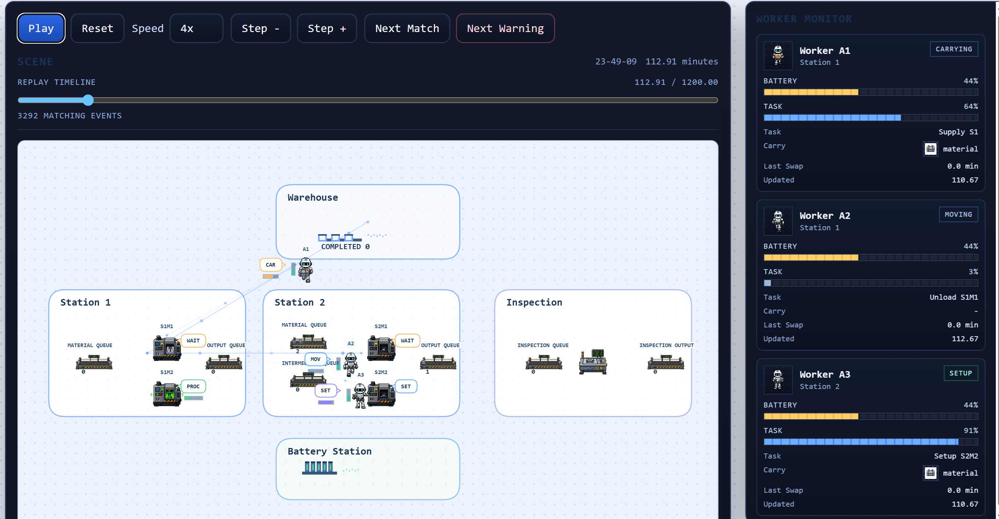

# ManSim

ManSim은 휴머노이드 작업자가 포함된 제조 및 조선 공정을 실행하는 discrete-event simulation
워크스페이스입니다. 결과는 공통 Results Hub, KPI dashboard, Gantt chart와 Replay Studio 3D에서
확인할 수 있습니다.

현재 릴리스 기준은 **ManSim v0.6.0**입니다. Worker의 State, Task, Primitive와 Incident 정의는
HumanoidSim이 소유하고, ManSim은 시나리오 상태에서 task 후보를 만들고 실행 결과를 기록합니다.

## 주요 기능

- scenario registry 기반의 <code>factory_mfg_basic</code>, <code>mfg_flow_shop</code>, <code>shipyard_basic</code>
- HumanoidSim task/primitive catalog와 시나리오별 확률 timing profile
- Immediate, Strict Periodic Rolling Horizon, dedicated-role 정책
- OR-Tools throughput optimizer와 선택형 Simulation-Based ADP
- KPI, OTC, Gantt, 공통 Hub와 Replay Studio 3D
- artifact, KPI, finite-buffer, task lifecycle와 공간 이동 감사
- seed, worker 수, 정책과 목적함수를 통제하는 policy comparison suite

세부 변경 사항은 [v0.6 Release Notes](docs/v0.6_release_notes.md)를 참고합니다.

## 시나리오

| Scenario | 설명 | 주요 결과 |
| --- | --- | --- |
| <code>factory_mfg_basic</code> | Station 1, Station 2, Inspection으로 이어지는 기본 제조 시나리오 | accepted products, throughput, lead time |
| <code>mfg_flow_shop</code> | 병렬 설비, 유한 버퍼, inspection desk와 worker별 charging dock를 사용하는 flow shop | throughput 또는 initial-batch makespan |
| <code>shipyard_basic</code> | 선박 외관 tile의 용접, 표면처리, 도장, 검사와 cart logistics | completed surface tiles, makespan |

기본 scenario는 <code>factory_mfg_basic</code>이며 명시적으로 변경할 수 있습니다.

~~~powershell
.\.venv\Scripts\python.exe main.py scenario=mfg_flow_shop
.\.venv\Scripts\python.exe main.py scenario=shipyard_basic
~~~

## 설치

Python 3.12 이상을 권장합니다. 기본 rule-based policy 실험과 simulation에는 외부 LLM,
ROS2, Gazebo, Omniverse가 필요하지 않습니다.

~~~powershell
cd C:\Github
git clone https://github.com/Ha-An/ManSim.git
git clone https://github.com/Ha-An/HumanoidSim.git
cd ManSim
py -3.12 -m venv .venv
.\.venv\Scripts\Activate.ps1
python -m pip install --upgrade pip
python -m pip install -r requirements.txt
python -m pip install -e ..\HumanoidSim
python -m humanoidsim validate-catalog
python -m pip check
~~~

ADP 학습과 추론을 사용할 때만 CUDA PyTorch가 포함된 선택 의존성을 설치합니다.

~~~powershell
python -m pip install -r requirements-adp.txt
~~~

설치 옵션과 GPU 확인 방법은 [Installation Guide](docs/installation.md)에 정리되어 있습니다.

## 빠른 실행

~~~powershell
.\.venv\Scripts\python.exe main.py scenario=factory_mfg_basic decision=rolling_horizon_dedicated_roles scenario.horizon.num_days=5
~~~

브라우저 자동 실행을 끄려면 다음 override를 사용합니다.

~~~powershell
.\.venv\Scripts\python.exe main.py runtime.ui.auto_open_results=false runtime.ui.auto_start_replay_studio_3d=false
~~~

Hydra 출력 경로를 고정할 수 있습니다.

~~~powershell
.\.venv\Scripts\python.exe main.py scenario=mfg_flow_shop decision=immediate_shared hydra.run.dir=outputs/my_run
~~~

## 기본 정책 비교 실험

기본 profile은 `mfg_flow_shop`, 5일 throughput, worker 3명과 held-out seed 5개에서
`simulation_based_adp`, `immediate_shared`, `random_feasible_dispatch`를 비교하는 15개 run입니다.
ADP checkpoint를 명시해야 하며, 완료 후 audit과 집계를 수행하고
`comparison_dashboard.html`을 자동으로 엽니다.

~~~powershell
.\.venv\Scripts\python.exe experiments/factory_policy_comparison/run_experiment.py --adp-checkpoint C:/path/to/best.pt --dry-run
.\.venv\Scripts\python.exe experiments/factory_policy_comparison/run_experiment.py --adp-checkpoint C:/path/to/best.pt --jobs 5
~~~

브라우저를 열 수 없는 환경에서는 `--no-open-dashboard`를 추가합니다. 자세한 실행 옵션과 결과
구조는 [Factory Policy Comparison](experiments/factory_policy_comparison/README.md)을 참고합니다.

이전의 두 목적함수, 4개 rule-based 정책, worker 3~6명, seed 2026 조합 32-run 실험은
`config_mfg_flow_shop_4policy_objectives.yaml`로 보존합니다.

## Legacy Factory 6-Policy 비교 실험

기본 factory 실험은 다음 정책을 같은 scenario, horizon과 seed에서 비교합니다.

- <code>fixed_priority</code>
- <code>adaptive_priority</code>
- <code>rolling_horizon_aging_priority</code>
- <code>rolling_horizon_dedicated_roles</code>
- <code>bottleneck_aware_dispatch</code>
- <code>rolling_horizon_throughput_optimizer</code>

~~~powershell
.\.venv\Scripts\python.exe experiments/factory_policy_comparison/run_experiment.py --config experiments/factory_policy_comparison/config_factory_mfg_basic.yaml
~~~

Runner는 run별 KPI와 config fingerprint를 확인하고 결과를 CSV, JSON과
<code>comparison_dashboard.html</code>로 집계합니다. OR-Tools 정책은 OR-Tools가 없거나 feasible
solution을 만들지 못하면 fallback 없이 실패합니다.

## mfg_flow_shop

<code>mfg_flow_shop</code>은 Station 1과 Station 2에 각각 병렬 설비 2대를 둡니다.

- Station 1 가공시간: triangular <code>7 / 8.5 / 11분</code>
- Station 2 가공시간: triangular <code>10 / 12.5 / 16분</code>
- Inspection desk capacity: 1
- Station 1 material input/output capacity: <code>4 / 2</code>
- Station 2 material/intermediate/output capacity: <code>4 / 4 / 2</code>
- Inspection input/pass/scrap queue capacity: 각각 <code>3</code>
- CompletedProducts와 ScrapDisposal: 무제한 terminal store

Destination buffer는 task가 worker queue에 확정될 때 inbound slot을 예약합니다. Queue 점유량과
inbound reservation의 합은 capacity를 넘을 수 없습니다. 가공 완료 후 output buffer가 가득 차면
item은 machine 안에 남고 해당 machine은 공간이 확보될 때까지 다음 cycle을 시작하지 않습니다.
Material 보충량은 고정 목표 재고가 아니라 미충족 machine 수요에서 queue와 inbound 재고를 뺀
값으로 계산합니다.

Machine 고장은 달력시간이 아니라 실제 가공 누적시간을 기준으로 평균 300분의
지수분포 threshold를 사용합니다. 240 가공분마다 예방정비가 due가 되며, 정비 후
다음 240 가공분은 고장 hazard가 0.5배로 낮아집니다. Repair urgency는 station의
가용 설비, 정지 비율, 처리 수요와 machine 내 WIP를 반영합니다.

Inspection은 세 개의 독립 task로 실행됩니다.

~~~text
LOAD_UNLOAD_TRANSFER_INTERFACE (desk load)
-> INSPECT_PRODUCT
-> LOAD_UNLOAD_TRANSFER_INTERFACE (desk unload)
~~~

Battery item 교환이나 전달은 사용하지 않습니다. Worker는 자신의 charging dock로 이동해 직접
충전하며, dock tile에 도착한 뒤에만 SOC가 증가합니다. Battery margin이 음수인 작업도
후보에서 제거하지 않아 정책이 위험을 판단합니다. 방전되면 현재 tile에 item을 내려놓고
`DISABLED`로 대기한 뒤, 다음 day boundary에 전용 dock에서 SOC 100%로 복귀합니다.

### 목적함수

Throughput 모드는 매일 warehouse를 설정량까지 보충하고 지정한 일수까지 실행합니다.

~~~powershell
.\.venv\Scripts\python.exe main.py scenario=mfg_flow_shop scenario.objective.mode=maximize_throughput scenario.horizon.num_days=5
~~~

Makespan 모드는 최초 warehouse material만 처리하며 보충하지 않습니다. 초기 material lineage가
accepted product 또는 ScrapDisposal에 도착한 scrap으로 모두 종결되면 조기 종료합니다.

~~~powershell
.\.venv\Scripts\python.exe main.py scenario=mfg_flow_shop scenario.objective.mode=minimize_makespan
~~~

### 대표 정책

| Decision mode | Dispatch 시점 | 역할 |
| --- | --- | --- |
| <code>immediate_shared</code> | worker가 idle이면 즉시 | 모든 생산 역할 공유 |
| <code>immediate_dedicated_roles</code> | worker가 idle이면 즉시 | 실행 전 LPT 역할 고정 |
| <code>rolling_horizon_shared</code> | strict periodic window 경계 | 모든 생산 역할 공유 |
| <code>rolling_horizon_dedicated_roles</code> | strict periodic window 경계 | 실행 전 LPT 역할 고정 |

Rolling Horizon은 worker polling이 아니라 독립 SimPy coordinator가 정확한
<code>t = window, 2*window, ...</code> 시각에 미시작 queue를 회수하고 전체 재할당합니다. 실행 중
task는 선점하지 않으며, <code>mfg_flow_shop</code>의 critical repair는 idle worker queue를 즉시 갱신할 수 있습니다. Battery charge는 강제 삽입되지 않고 생산 task와 함께 정책이 선택합니다.

### Worker 3 기본 정책 비교

ADP 실험에서는 동일한 `mfg_flow_shop`, 5일 throughput 목적, worker 3명과 held-out seed를 사용해
다음 세 정책을 비교합니다.

| Decision mode | 선택 방식 | 비교 역할 |
| --- | --- | --- |
| <code>random_feasible_dispatch</code> | 충돌 없는 feasible task를 균등 무작위 선택 | 학습 없는 무작위 기준선 |
| <code>immediate_shared</code> | idle event마다 고정 priority로 즉시 선택 | 반응형 shared rule 기준선 |
| <code>simulation_based_adp</code> | 가치망과 beam search로 joint assignment 선택 | 학습 기반 정책 |

정책 비교 dashboard는 평균 제품 수, 표준편차, 95% CI, worker 실행비율과 seed별 paired
difference를 함께 표시합니다. ADP의 주 비교 대상은 `immediate_shared`이며, 같은 seed에서의 평균
차이가 양수이고 paired bootstrap 95% CI 하한도 0보다 클 때만 우위를 입증한 것으로 판정합니다.
이 결과는 해당 환경·worker 수·horizon에 대한 실험 근거이며 모든 제조 환경에 대한 일반적 우위를
뜻하지 않습니다.

## Task와 Primitive Timing

HumanoidSim은 task와 primitive의 구조를 소유하고, ManSim은 시나리오별 시간분포를 소유합니다.

~~~text
configs/task_primitive_timing/factory_mfg_basic.yaml
configs/task_primitive_timing/mfg_flow_shop.yaml
configs/task_primitive_timing/shipyard_basic.yaml
~~~

각 task의 primitive occurrence는 exact <code>step_path</code>로 정의합니다. Primitive와 machine
processing time은 triangular distribution에서 전용 RNG stream으로 sample합니다.
<code>NAVIGATE_TO</code>는 이동을 시작할 때 tile당 시간을 한 번 sample하고 실제 edge 수와 적재
multiplier를 곱합니다. Timing profile 누락, 중복, call code 불일치와 잘못된 분포는 실행 전에
오류로 처리됩니다.

## Artifact와 Dashboard

주요 출력은 Hydra run directory에 생성됩니다.

| 파일 | 용도 |
| --- | --- |
| <code>results_dashboard.html</code> | 공통 Results Hub |
| <code>kpi.json</code>, <code>kpi_dashboard.html</code> | KPI 원본과 상세 화면 |
| <code>gantt.html</code>, <code>gantt_segments.csv</code> | task 및 상태 timeline |
| <code>daily_summary.json</code> | 일별 생산 집계 |
| <code>run_meta.json</code> | scenario, policy, seed와 fingerprint |
| <code>pre_run_diagnostics.json/html</code> | policy-independent 사전 지표 |
| <code>replay_studio_layout.json</code> | compact map layout |

정책 비교 실험은 디스크 사용량을 줄이기 위해 <code>events.jsonl</code>과 대용량 Replay artifact를
기본 저장하지 않습니다. KPI와 Gantt는 simulation 중 memory event로 생성되므로 정책 결정과
성능 수치에는 영향이 없습니다. 이벤트 단위 감사와 visual replay가 필요한 run만 다음을
명시합니다.

~~~powershell
runtime.artifacts.export_events=true runtime.ui.export_replay_artifacts=true
~~~

## 검증

~~~powershell
.\.venv\Scripts\python.exe -m unittest discover -s tests
.\.venv\Scripts\python.exe scripts/audit_kpi.py outputs/my_run
.\.venv\Scripts\python.exe scripts/audit_run_artifacts.py outputs/my_run
~~~

<code>mfg_flow_shop</code> 감사에서는 buffer overflow, reservation failure/leak,
<code>occupancy + inbound reservations <= capacity</code>, blocked-after-service, 역할 위반,
inspection lifecycle와 이동 연속성을 확인합니다.

## 문서

2026-09-26 기준 점검 내용은 [정책 실험 감사](docs/audits/2026-09-26_policy_study_audit.md)와
[ADP 효율성 검토](docs/audits/2026-09-26_adp_efficiency_review.md)에 기록했습니다.
설비 PM과 processing의 중첩을 수정했으므로 수정 전 결과를 새 환경의 성능으로 해석해서는
안 됩니다. 기존 결과와 checkpoint는 로컬에 보존하며 Git에는 대용량 실험 산출물을 포함하지
않습니다. 효율 개선 전 복구 기준은 [최적화 기준점](docs/adp_efficiency.md)을 참고하세요.

- [Documentation Index](docs/README.md)
- [Installation Guide](docs/installation.md)
- [Simulator Core Guide](docs/simulator_core_guide.md)
- [Decision Logic](docs/decision_logic.md)
- [Scenario Timing](docs/scenario_timing.md)
- [Humanoid Worker Model](docs/humanoid_worker_model.md)
- [Movement Model](docs/humanoid_movement_model.md)
- [Replay and Dashboards](docs/replay_dashboards.md)
- [Factory Policy Comparison](experiments/factory_policy_comparison/README.md)

## Simulation-Based ADP (Optional)

<code>simulation_based_adp</code>는 <code>mfg_flow_shop / maximize_throughput / worker 3</code>용
event-driven joint assignment 정책입니다. 기본 학습은
<code>configs/adp/mfg_flow_shop_throughput.yaml</code>의 n-step TD profile을 사용합니다.

기본 비교 계약에서는 명시적 WAIT를 사용하지 않습니다. 현재 mfg_flow_shop의 충전은
일반 정책 선택 대상이며, idle worker는 conflict-free feasible task가 있으면 하나를 선택합니다. 수행할 수
있는 task가 없는 강제 유휴는 WAIT 행동으로 집계하지 않습니다. WAIT 구현은 ablation을 위해
보존되어 있으며 설정에서 명시적으로 다시 켤 수 있습니다.

초기 random 데이터부터 n-step TD(`n=30`)와 MSE로 학습합니다. 실제 완료 제품 보상과
target value network의 bootstrap을 사용하며 gamma는 1, episode 종료 bootstrap은 0입니다.
중간 행동이 업데이트 시작 시 고정한 greedy 정책과 다르면 그 행동 전에 target을 끊습니다.
최근 100 episode의 CPU compact transition을 bounded replay로 유지하고 만료된 episode는 폐기합니다.
정책 업데이트에는 현재 wave 10 episode를 모두 포함하고, 과거 replay에서 episode 20개를
균등 추출해 총 30개의 완전한 episode를 사용합니다.
Target network는 SGD step마다 tau=0.03으로 갱신합니다. Conservative gate, WAIT, potential
shaping과 pairwise MC loss는 기본 비활성화입니다.

Rollout은 CPU process 10개가 wave당 10 episode를 생성합니다. Main process만 <code>cuda:0</code>에서
network를 업데이트합니다. 초기 random 50 episode를 5 wave로 수집해 전체 50 episode로
1 epoch 초기 학습하고, 이후 매 10-episode wave마다 75번 업데이트합니다. 정책 업데이트는
현재 10 episode와 과거 replay에서 추출한 20 episode를 2 epoch 학습합니다. 총 800 training
episode와 76번의 가치망 업데이트를 수행합니다.
Epsilon은 iteration <code>0/25/50/75</code>에서 <code>0.50/0.15/0.08/0.05</code>, learning rate는
iteration <code>0/20/30/60/75</code>에서 <code>5e-5/5e-5/2e-5/2e-5/1e-5</code>가 되도록 구간별
선형 감소합니다. Validation은 checkpoint <code>0, 5, 10, ..., 75</code>에서 표시하며, screening
상위 3개 checkpoint를 각각 별도 seed 20개로 평가해 최종 checkpoint를 정합니다. Beam search는
의사결정마다 첫 worker를 순환해 고정된 worker 순서의 선점 편향을 줄입니다.

~~~powershell
.\.venv\Scripts\python.exe -m manufacturing_sim.adp.train --background
~~~

결과는 <code>outputs/adp_training_worker3_n_step_td/&lt;timestamp&gt;/</code>에 저장됩니다.

`--background`는 학습을 독립 프로세스로 실행하고 즉시 명령을 반환합니다. 학습 중에도 Codex에서
다른 작업을 할 수 있습니다. Chrome으로 열리는 `background_job/live_training.html`은 5초마다
현재 단계, iteration, wave별 완료 episode, 전체 진행률, 경과시간, CPU process 수, GPU 장치와
최근 로그를 갱신합니다. 기존 학습 그래프도 같은 화면에서 확인할 수 있으며 wave/iteration 완료 시 갱신됩니다.
`--no-open-dashboard`를 함께 주면 브라우저 자동 열기만 끕니다. 기존 동기 실행은 `--background`를 빼면 됩니다.
상태 확인과 중단 명령, worker별 연속 학습은 [백그라운드 학습](docs/adp_background_training.md)을 참고하세요.

백그라운드 실행은 재부팅 후 자동 재개를 의미하지 않습니다. 절전·종료·재부팅은 피하고, 학습 도중
다른 작업을 하더라도 해당 학습의 코드와 설정은 수정하지 않는 것을 권장합니다.

- <code>best.pt</code>, <code>last.pt</code>, <code>checkpoints/iteration_*.pt</code>
- <code>episode_metrics.csv</code>, <code>wave_metrics.csv</code>, <code>iteration_metrics.csv</code>
- <code>checkpoint_selection.csv</code>, <code>training_summary.json</code>
- <code>training_dashboard.html</code>
- <code>resolved_config.yaml</code>, <code>checkpoint_manifest.json</code>

이전 MC 실험은 `mfg_flow_shop_throughput_worker3_wave_updates.yaml`에 보존합니다.
이 legacy MC profile에서 `training.pairwise_mc_advantage.enabled=true`를 지정하면 동일한 상태에서 선택 행동과
하나의 feasible 대안 행동을 공통 seed로 끝까지 재실행하고,
`V(Sx_selected)-V(Sx_alternative)`가 실제 생산량 return 차이를 따르도록 추가 학습합니다. 이때
학습 대시보드에는 pair 수, branch 시간, 업데이트 전후 pair MSE와 return 차이 부호 정확도가
기록됩니다.

기본 TD dashboard는 checkpoint별 rollout/validation 생산량, TD train/holdout MSE,
미사용 greedy validation의 가치망 평균 예측과 실제 MC 평균 잔여 생산량, MC RMSE·편향,
실제 n과 target 종료 사유,
WAIT 계약, 지원 worker 수, beam worker 순서, 병렬 rollout 시간과 메모리를 표시합니다. 가치망은
Station별 buffer 점유·예약·잔여 용량, 설비의 idle/processing/blocked/broken 비율과 평균 잔여시간,
선택 edge의 이동·수행시간, battery margin, downstream progress, blockage 해소 여부 및 목적지
가용 용량을 입력으로 사용합니다. OOD 선택률과
OOD 과대평가 초과값은 현재 greedy 행동이 직전 on-policy batch의 지지영역을 벗어나는지 보여줍니다.
OOD 값은 경험적 진단이며 전역 최적해를 뜻하지 않습니다. 모든 그래프 하단에는 한국어
해석을 함께 표시합니다. `Beam 후보 가치 엔트로피`는 0에 가까울수록 소수 행동에 가치가
집중되고 1에 가까울수록 후보 행동의 예측 가치가 비슷함을 뜻하며, 생산량 추세와 함께
정책의 건전한 집중 또는 잘못된 과신을 진단합니다.
TD replay는 iteration 수가 아닌 최근 100 episode로 제한합니다. Episode ID가 10의 배수인
표본은 고정 holdout이며 경사 학습에 쓰지 않습니다. TD 오차와 실제 greedy 미래 생산량
예측 오차를 구분해야 합니다. 자세한 target 정의와 소형 검증 명령은
[n-step TD 학습](docs/adp_n_step_td.md)에 정리했습니다.

별도 반사실 행동 검증은 기본 TD 학습에 추가하지 않습니다. 기존 MC profile에서는
`diagnostics.value_validation.enabled: true`로 학습·checkpoint 선정 종료 후 실행할 수 있습니다.
학습에 미사용한 seed의 RMSE·평균 편향·시간 기준 오차와, 동일 상태에서 반복 실행한 후보들의
생산량 차이를 대시보드에 표시합니다. Worker 3에서 최대 40개의 진단 episode가 추가되며 기존
`1/50/12/1` wave와 별도로 시간을 기록합니다. 기존 결과에도 재학습 없이 적용할 수 있으며
실행법과 해석 범위는
[ADP 가치함수 독립 검증](docs/adp_value_validation.md)에 정리했습니다.

Checkpoint fingerprint에는 scenario, objective, 정확한 지원 worker 집합, worker 수별 환경,
timing profile, feature schema,
설비 ID와 수, processing distribution, finite-buffer capacity, inspection capacity와 지도 구조가
포함됩니다. 하나라도 현재 환경과 다르면 fallback 없이 오류로 종료합니다.
현재 feature schema는 <code>mfg_flow_shop_adp_v9</code>이며 terminal output까지의 예상 잔여시간을
task feature로 포함합니다. 이전 schema의 checkpoint는
명확한 불일치 오류로 거부됩니다.

~~~powershell
.\.venv\Scripts\python.exe main.py scenario=mfg_flow_shop decision=simulation_based_adp decision.adp.checkpoint_path=C:/path/to/best.pt
~~~

최종 기본 비교는 학습과 checkpoint 선택에 사용하지 않은 seed <code>50001~50005</code>에서 worker
3명에 대해 ADP, Immediate Shared와 Random Feasible을 총 15회 실행합니다.

~~~powershell
.\.venv\Scripts\python.exe experiments/factory_policy_comparison/run_experiment.py --adp-checkpoint C:/path/to/best.pt --jobs 5
~~~

비교 dashboard는 평균, 표준편차, 95% CI, paired bootstrap CI, win/tie/loss와
<code>ADP - Immediate Shared</code> 판정을 표시합니다.

### 논문용 worker 2~6 확증 실험

개발용 비교와 별도로 `experiments/mfg_flow_shop_paper/`에는 worker 2~6에 대해 ADP,
Immediate Shared, Random Feasible을 비교하는 축소 확증 실험이 준비되어 있습니다. Worker별
ADP를 한 번씩 총 5회 학습하고, 20개 공통 환경 seed로 총 300회 평가합니다. 학습 checkpoint는
worker별로 보존되어 나머지 휴리스틱 정책을 나중에 추가할 때 재사용할 수 있습니다.

~~~powershell
.\.venv\Scripts\python.exe experiments/mfg_flow_shop_paper/prepare_experiment.py
.\.venv\Scripts\python.exe experiments/mfg_flow_shop_paper/run_training.py --background
.\.venv\Scripts\python.exe experiments/mfg_flow_shop_paper/run_evaluation.py --jobs 5
~~~

세부 seed 계약, 예상 시간·용량과 통계 분석 단위는
[Confirmatory Policy Experiment](experiments/mfg_flow_shop_paper/README.md)을 참고하세요.
